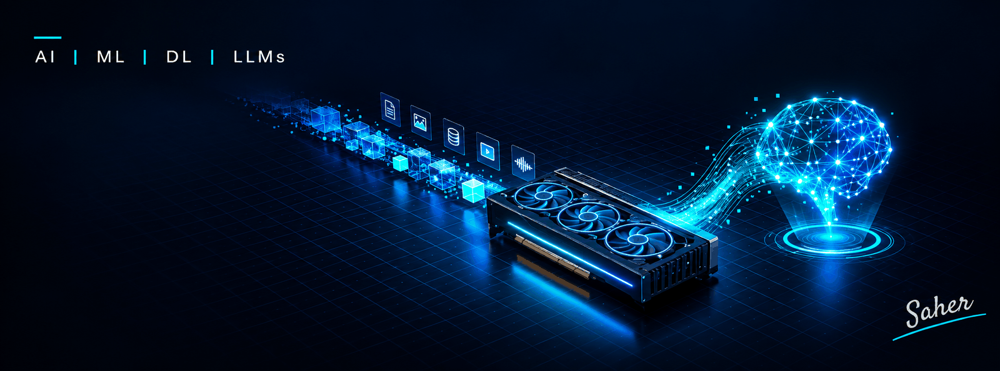

  

### 👋 Hi, I'm Saher (Abdul Saheer Mecheri)
I build and fine-tune AI models that turn data into useful tools.

🧠 Building models from scratch (PyTorch)  
🎯 Fine-tuning LLMs with LoRA / QLoRA  
🔎 Retrieval & RAG systems  
🌐 English + Arabic NLP  
📍 Riyadh, Saudi Arabia

### 🚀 Featured projects
- **[arabic-text-normalizer](https://github.com/abdulshaheerm/arabic-text-normalizer)**: a lightweight, dependency-free Python library + CLI that normalizes Arabic text for search and NLP (alef forms, ى/ي, tashkeel, tatweel, digits). Tested in CI on Python 3.9–3.13.

### 🛠️ Tech stack

  

Also: Hugging Face · LoRA / QLoRA · FAISS

### 📊 GitHub stats

  

### 🤝 Connect

